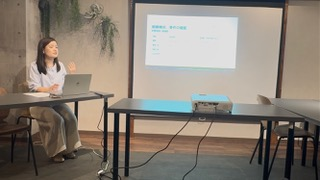
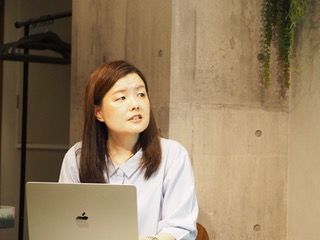
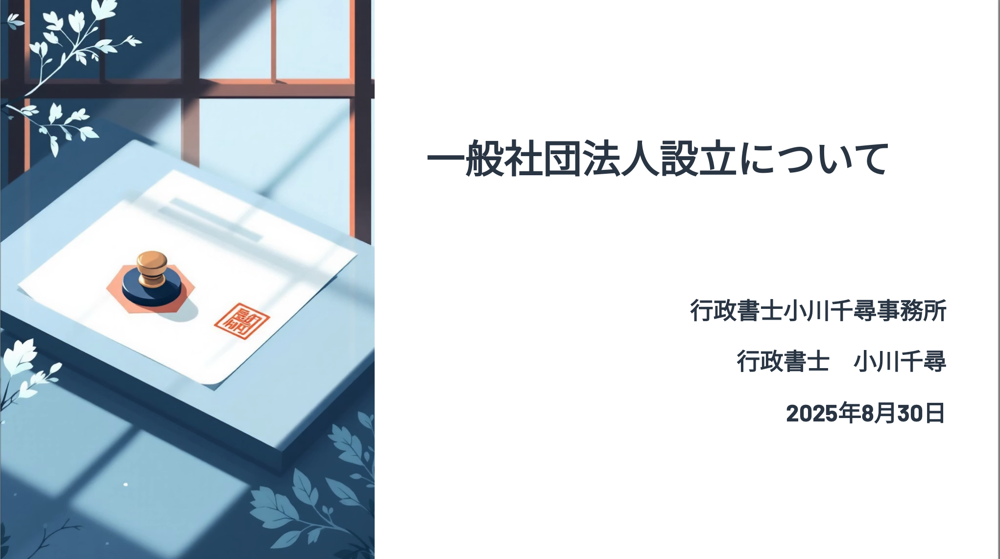

I planned and held a study session giving presentations each other with other lawyers. My own presentation was a great experience and I learned a lot from the presentations given by the other lawyers. I would like to continue holding these events on a regular basis from now on.

I gave a presentation on establishing a general incorporated association.

The type of corporation you establish (ex: a general incorporated association, a joint-stock company and a limited liability company) will depend on your plan. If you are considering establishment, please feel free to contact us.

**📄 [Click here to view the presentation PDF](/content/blog/en/08312025/corporation-guide.pdf)**
